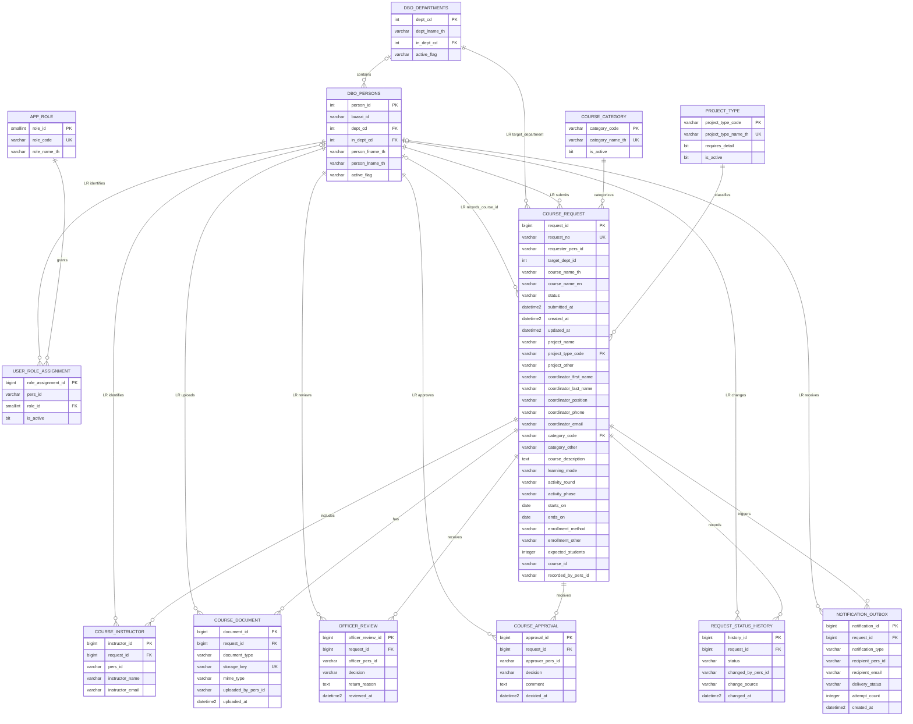

# ระบบคำร้องขอสร้างรายวิชา — Data Dictionary และ ERD

เอกสารนี้อ้างอิงโครงสร้างเป้าหมาย SQL Server ในฐาน `academy_db1447` ซึ่งสร้างผ่าน Laravel Migration ใน `database/migrations/course133` ส่วน PostgreSQL ใน `database/design` ใช้เป็นฐานจำลองบนเครื่องเท่านั้น

## ภาพรวมระบบ

```text
Requester กรอกคำร้อง
→ ดาวน์โหลด PDF
→ ลงนามและอัปโหลด PDF กลับ
→ Officer ตรวจเอกสาร
→ Approver พิจารณา
→ บุคคลภายนอกสร้าง Course ID
→ Officer กรอก Course ID
→ Requester เห็นผล
```

ระบบจริงแยกเป็นสอง SQL Server databases:

| ฐานข้อมูล | Schema | หน้าที่ |
|---|---|---|
| `saladb` บน Server 199 | `dbo` | บุคลากรและหน่วยงานจาก `dbo.persons` และ `dbo.departments` |
| `academy_db1447` บน Server 133 | `course133` | สิทธิ์ คำร้อง เอกสาร การตรวจ การอนุมัติ และ Course ID |

ฐาน 133 อ้าง `dbo.persons.person_id` และ `dbo.departments.dept_cd` แบบ **Logical Reference (LR)** โดยไม่สร้าง Foreign Key ข้าม Server ช่วงแรกสามารถใช้ค่า `int` ที่กำหนดไว้ใน Laravel และค่อยเพิ่มการตรวจสอบกับ connection ของฐาน 199 ภายหลัง

## สัญลักษณ์

| สัญลักษณ์ | ความหมาย |
|---|---|
| PK | Primary Key |
| UK | Unique Key |
| FK | Foreign Key ภายใน database เดียวกัน |
| LR | Logical Reference ไปอีก database |
| NULL | ไม่จำเป็นต้องมีค่า |
| NOT NULL | ต้องมีค่า |

## ERD

ความสัมพันธ์ที่มีคำว่า `LR` เป็น Logical Reference ระหว่าง Server 133 กับ Server 199 จึงไม่มี Foreign Key ข้าม Server

ความสัมพันธ์หน่วยงานแม่–ลูกยังมีอยู่ โดย `dbo.departments.in_dept_cd` อ้าง `dbo.departments.dept_cd` แต่ไม่แสดงเป็นเส้นวนในภาพใหญ่เพื่อให้อ่านง่าย



> เส้นที่ติดป้าย `LR` ใช้อธิบายความสัมพันธ์เชิงระบบเท่านั้น ไม่มี constraint ข้าม database จริง

# Data Dictionary: Server 199 / `saladb.dbo`

ฝั่ง 199 ใช้ตาราง `saladb.dbo.persons` 52 คอลัมน์และ `saladb.dbo.departments` 18 คอลัมน์ตาม metadata ที่ export จาก SSMS รายละเอียดทุกคอลัมน์อยู่ใน [Snapshot SQL Server 199 — Data Dictionary](sqlserver199-snapshot-data-dictionary.md)

ตารางนี้ไม่เก็บ password การเข้าสู่ระบบต้องให้ SSO/LDAP ยืนยัน `buasri_id` แล้วจึงอ่าน `person_id` จาก `dbo.persons`

# Data Dictionary: Server 133 / `academy_db1447.course133`

## `course133.app_role`

รายการบทบาทของระบบ

| Column | Type | Key / Null | Default | ความหมาย |
|---|---|---|---|---|
| `role_id` | smallint identity | PK | auto | รหัสบทบาท |
| `role_code` | varchar(30) | UK, NOT NULL | — | `REQUESTER`, `OFFICER`, `APPROVER` |
| `role_name_th` | varchar(100) | NOT NULL | — | ชื่อบทบาทภาษาไทย |

## `course133.user_role_assignment`

จับคู่บุคลากรกับบทบาท บุคลากรหนึ่งคนมีได้หลายบทบาท

| Column | Type | Key / Null | Default | ความหมาย |
|---|---|---|---|---|
| `role_assignment_id` | bigint identity | PK | auto | รหัสรายการมอบหมายสิทธิ์ |
| `pers_id` | int | LR, NOT NULL | — | เก็บค่า `dbo.persons.person_id` ชนิด int |
| `role_id` | smallint | FK, NOT NULL | — | อ้าง `app_role.role_id` |
| `is_active` | bit | NOT NULL | `1` | สิทธิ์นี้ยังเปิดใช้งาน |

Approver และ Officer ไม่จำกัดหน่วยงานจากตารางนี้ จึงไม่มี `scope_dept_id`

## `course133.project_type`

Master ประเภทโครงการสำหรับเรียกแสดงในแบบฟอร์ม

| Column | Type | Key / Null | Default | ความหมาย |
|---|---|---|---|---|
| `project_type_code` | varchar(30) | PK | — | รหัสคงที่ เช่น `INCOME_SERVICE`, `NO_INCOME_SERVICE`, `RESEARCH`, `OTHER` |
| `project_type_name_th` | varchar(150) | UK, NOT NULL | — | ชื่อประเภทโครงการภาษาไทย |
| `requires_detail` | bit | NOT NULL | `0` | ต้องกรอกรายละเอียดเพิ่มเติมหรือไม่ |
| `is_active` | bit | NOT NULL | `1` | เปิดให้เลือกในแบบฟอร์มหรือไม่ |

## `course133.course_category`

Master หมวดหมู่รายวิชาสำหรับเรียกแสดงในแบบฟอร์ม

| Column | Type | Key / Null | Default | ความหมาย |
|---|---|---|---|---|
| `category_code` | varchar(30) | PK | — | รหัสหมวดหมู่คงที่ |
| `category_name_th` | varchar(150) | UK, NOT NULL | — | ชื่อหมวดหมู่ภาษาไทย |
| `is_active` | bit | NOT NULL | `1` | เปิดให้เลือกในแบบฟอร์มหรือไม่ |

## `course133.course_request`

ตารางหลักของคำร้องและสถานะปัจจุบัน

ส่วนงานต้นสังกัดของผู้ยื่นไม่เก็บซ้ำในตารางนี้ ช่วงที่ยังไม่เชื่อม Server 199 ระบบอ่านจากข้อมูลผู้ใช้ชั่วคราว และภายหลังจะหา `persons.dept_cd` จาก `requester_pers_id` แล้วอ่านชื่อจาก `departments`

| Column | Type | Key / Null | Default | ความหมาย |
|---|---|---|---|---|
| `request_id` | bigint identity | PK | auto | รหัสคำร้องภายใน |
| `request_no` | varchar(30) | UK, NOT NULL | — | เลขคำร้องที่แสดงต่อผู้ใช้ |
| `requester_pers_id` | int | LR, NOT NULL | — | ผู้ยื่นจาก `dbo.persons.person_id` |
| `target_dept_id` | int | LR, NOT NULL | — | หน่วยงานเป้าหมายที่ผู้ยื่นเลือก; ช่วงที่ยังไม่เชื่อม 199 ตรวจจาก `config/departments.php` และภายหลังจะอ้าง `saladb.dbo.departments.dept_cd`; เจ้าหน้าที่สำนักคอมพิวเตอร์ยังเป็นผู้รับตรวจคำร้องทุกหน่วยงาน |
| `course_name_th` | varchar(500) | NOT NULL | — | ชื่อรายวิชาภาษาไทย |
| `course_name_en` | varchar(500) | NOT NULL | — | ชื่อรายวิชาภาษาอังกฤษ |
| `status` | varchar(40) | NOT NULL | `DRAFT` | สถานะ workflow ปัจจุบัน |
| `submitted_at` | datetime2 | NULL | `NULL` | เวลาที่ผู้ยื่นส่งคำร้อง |
| `created_at` | datetime2 | NOT NULL | SYSDATETIME() | เวลาสร้างตามเวลา Asia/Bangkok |
| `updated_at` | datetime2 | NOT NULL | SYSDATETIME() | เวลาแก้ไขล่าสุดตามเวลา Asia/Bangkok โดย Laravel เป็นผู้ปรับค่า |
| `project_name` | varchar(500) | NOT NULL | — | ชื่อโครงการ |
| `project_type_code` | varchar(30) | FK, NOT NULL | — | อ้าง `project_type.project_type_code` |
| `project_other` | varchar(500) | Conditional | `NULL` | ต้องมีเมื่อ `project_type_code = 'OTHER'` |
| `coordinator_first_name` | varchar(100) | NOT NULL | — | ชื่อผู้ประสานงานโครงการ |
| `coordinator_last_name` | varchar(100) | NOT NULL | — | นามสกุลผู้ประสานงานโครงการ |
| `coordinator_position` | varchar(200) | NOT NULL | — | ตำแหน่งของผู้ประสานงานในโครงการ |
| `coordinator_phone` | varchar(50) | NOT NULL | — | เบอร์โทรศัพท์ติดต่อหรือเบอร์ภายใน |
| `coordinator_email` | varchar(254) | NOT NULL | — | อีเมลมหาวิทยาลัยของผู้ประสานงาน |
| `category_code` | varchar(30) | FK, NOT NULL | — | อ้าง `course_category.category_code` |
| `category_other` | varchar(500) | Conditional | `NULL` | ต้องมีเมื่อ `category_code = 'OTHER'` |
| `course_description` | text | NOT NULL | — | รายละเอียดรายวิชา |
| `learning_mode` | varchar(100) | NOT NULL | — | ลักษณะการดำเนินกิจกรรม: เปิดตามวงรอบ หรือเปิดตามกรอบระยะเวลาของโครงการ |
| `activity_round` | varchar(500) | Conditional | `NULL` | วงรอบ/รุ่น เช่น `รุ่นที่ 1`; บังคับเมื่อเปิดแบบตามวงรอบ |
| `activity_phase` | varchar(250) | Conditional | `NULL` | เฟส เช่น `เฟส 1/2569`; บังคับเมื่อเปิดแบบตามวงรอบ |
| `starts_on` | date | Conditional | `NULL` | วันที่เริ่มดำเนินกิจกรรม; บังคับสำหรับค่าลักษณะกิจกรรมแบบใหม่ |
| `ends_on` | date | Conditional | `NULL` | วันที่สิ้นสุดกิจกรรม; บังคับสำหรับค่าลักษณะกิจกรรมแบบใหม่และต้องไม่น้อยกว่า `starts_on` |
| `enrollment_method` | varchar(100) | NOT NULL | — | วิธีสมัครหรือเข้าเรียน |
| `enrollment_other` | varchar(500) | Conditional | `NULL` | ต้องมีเมื่อ `enrollment_method = 'อื่น ๆ (ระบุ)'` |
| `expected_students` | integer | NOT NULL | — | จำนวนผู้เรียนที่คาดการณ์ ต้องมากกว่า 0 |
| `course_id` | varchar(100) | NULL | `NULL` | Course ID ที่บุคคลภายนอกสร้างและ Officer นำมากรอก |
| `recorded_by_pers_id` | int | LR, NULL | `NULL` | Officer ผู้บันทึก Course ID จากฐาน 199 |

## `course133.course_instructor`

ผู้สอนของคำร้อง หนึ่งคำร้องต้องมีอย่างน้อยหนึ่งคนและมีได้หลายคน โดยเก็บอาจารย์หนึ่งคนต่อหนึ่งแถวและใช้ `request_id` เดียวกัน ชื่อและนามสกุลจากฟอร์มจะประกอบเก็บใน `instructor_name` หากต้องเรียงผลลัพธ์ให้ใช้ `instructor_id`

| Column | Type | Key / Null | Default | ความหมาย |
|---|---|---|---|---|
| `instructor_id` | bigint identity | PK | auto | รหัสรายการผู้สอน |
| `request_id` | bigint | FK, NOT NULL | — | อ้าง `course_request.request_id` |
| `pers_id` | int | LR, NULL | `NULL` | รหัสบุคลากรในฐาน 199 ถ้าเป็นบุคลากรภายใน |
| `instructor_name` | varchar(300) | NOT NULL | — | ชื่อผู้สอนตามคำร้อง |
| `instructor_email` | varchar(254) | NOT NULL | — | อีเมลผู้สอน |

## `course133.course_document`

เก็บ metadata ของไฟล์ ไฟล์จริงอยู่ใน storage

| Column | Type | Key / Null | Default | ความหมาย |
|---|---|---|---|---|
| `document_id` | bigint identity | PK | auto | รหัสเอกสาร |
| `request_id` | bigint | FK, NOT NULL | — | อ้าง `course_request.request_id` |
| `document_type` | varchar(40) | NOT NULL | — | `GENERATED_FORM`, `SIGNED_FORM`, `ADDITIONAL_DOCUMENT` |
| `storage_key` | varchar(1000) | UK, NOT NULL | — | path หรือ object key ของไฟล์ |
| `original_filename` | varchar(500) | NOT NULL | — | ชื่อไฟล์ต้นฉบับ |
| `mime_type` | varchar(100) | NOT NULL | — | MIME type; `SIGNED_FORM` ต้องเป็น `application/pdf` |
| `file_size_bytes` | bigint | NOT NULL | — | ขนาดไฟล์ ต้องมากกว่า 0 |
| `uploaded_by_pers_id` | int | LR, NOT NULL | — | ผู้สร้างหรืออัปโหลดจากฐาน 199 |
| `uploaded_at` | datetime2 | NOT NULL | SYSDATETIME() | เวลาอัปโหลดตามเวลา Asia/Bangkok |

เมื่ออัปโหลดเอกสารใหม่ ระบบเพิ่มแถวใหม่และใช้ `uploaded_at` เรียงจากใหม่ไปเก่า โดยเอกสารประเภท `ADDITIONAL_DOCUMENT` จำกัดไม่เกิน 5 ไฟล์ต่อคำร้องที่ระดับ Laravel

## `course133.officer_review`

ผลตรวจของ Officer เก็บได้หลายรอบต่อคำร้อง

| Column | Type | Key / Null | Default | ความหมาย |
|---|---|---|---|---|
| `officer_review_id` | bigint identity | PK | auto | รหัสการตรวจ |
| `request_id` | bigint | FK, NOT NULL | — | อ้าง `course_request.request_id` |
| `officer_pers_id` | int | LR, NOT NULL | — | Officer จากฐาน 199 |
| `decision` | varchar(20) | NOT NULL | — | `PASSED` หรือ `RETURNED` |
| `return_reason` | text | NULL | `NULL` | เหตุผลส่งกลับ ต้องมีเมื่อเป็น `RETURNED` และส่งให้ Requester |
| `reviewed_at` | datetime2 | NOT NULL | SYSDATETIME() | เวลาตรวจตามเวลา Asia/Bangkok |

## `course133.course_approval`

ผลพิจารณาของผู้มีอำนาจ เก็บได้หลายรอบต่อคำร้อง

| Column | Type | Key / Null | Default | ความหมาย |
|---|---|---|---|---|
| `approval_id` | bigint identity | PK | auto | รหัสการพิจารณา |
| `request_id` | bigint | FK, NOT NULL | — | อ้าง `course_request.request_id` |
| `approver_pers_id` | int | LR, NOT NULL | — | ผู้พิจารณาจากฐาน 199 |
| `decision` | varchar(20) | NOT NULL | — | `APPROVED`, `REJECTED`, `RETURNED` |
| `comment` | text | NULL | `NULL` | เหตุผลที่ส่งให้ Requester; บังคับเมื่อไม่ใช่ `APPROVED` |
| `decided_at` | datetime2 | NOT NULL | SYSDATETIME() | เวลาพิจารณาตามเวลา Asia/Bangkok |

## `course133.request_status_history`

Audit trail ของการเปลี่ยนสถานะ เพิ่มแถวใหม่ทุกครั้งโดยไม่เขียนทับประวัติเก่า

| Column | Type | Key / Null | Default | ความหมาย |
|---|---|---|---|---|
| `history_id` | bigint identity | PK | auto | รหัสประวัติ |
| `request_id` | bigint | FK, NOT NULL | — | อ้าง `course_request.request_id` |
| `status` | varchar(40) | NOT NULL | — | สถานะของคำร้อง ณ เหตุการณ์นี้ |
| `changed_by_pers_id` | int | LR, NULL | `NULL` | ผู้เปลี่ยนจากฐาน 199; ว่างเมื่อระบบเปลี่ยนเอง |
| `change_source` | varchar(30) | NOT NULL | — | `REQUESTER`, `OFFICER`, `APPROVER`, `SYSTEM` |
| `changed_at` | datetime2 | NOT NULL | SYSDATETIME() | เวลาเปลี่ยนสถานะตามเวลา Asia/Bangkok |

## `course133.notification_outbox`

คิวแจ้งเตือนสำหรับ backend worker ตารางนี้ไม่ส่งอีเมลด้วยตัวเอง

| Column | Type | Key / Null | Default | ความหมาย |
|---|---|---|---|---|
| `notification_id` | bigint identity | PK | auto | รหัสรายการแจ้งเตือน |
| `request_id` | bigint | FK, NOT NULL | — | อ้าง `course_request.request_id` |
| `notification_type` | varchar(50) | NOT NULL | — | ประเภท เช่น `OFFICER_REVIEW_REQUIRED` |
| `recipient_pers_id` | int | LR, NULL | `NULL` | ผู้รับจากฐาน 199 ถ้ามี |
| `recipient_email` | varchar(254) | NOT NULL | — | อีเมลปลายทาง |
| `delivery_status` | varchar(20) | NOT NULL | `PENDING` | `PENDING`, `SENDING`, `SENT`, `FAILED` |
| `attempt_count` | integer | NOT NULL | `0` | จำนวนครั้งที่พยายามส่ง ต้องไม่ติดลบ |
| `sent_at` | datetime2 | NULL | `NULL` | เวลาที่ส่งสำเร็จ |
| `last_error` | text | NULL | `NULL` | error ล่าสุด |
| `created_at` | datetime2 | NOT NULL | SYSDATETIME() | เวลาสร้างคิวตามเวลา Asia/Bangkok |

## สถานะคำร้อง

| Status | ความหมาย | ผู้เห็นหรือผู้ดำเนินการถัดไป |
|---|---|---|
| `DRAFT` | กำลังกรอก ยังไม่ยื่น | Requester |
| `PENDING_SIGNED_DOCUMENT` | ส่งข้อมูลแล้ว รอ PDF ลงนาม | Requester; Officer ยังไม่เห็น |
| `UNDER_OFFICER_REVIEW` | มี PDF ลงนามแล้ว รอตรวจ | Officer |
| `RETURNED_FOR_REVISION` | ถูกส่งกลับให้แก้ไข | Requester |
| `PENDING_APPROVAL` | Officer ตรวจผ่าน | Approver |
| `REJECTED` | ผู้มีอำนาจไม่อนุมัติ | จบกระบวนการ |
| `PENDING_COURSE_ID` | อนุมัติแล้ว รอ Course ID จากบุคคลภายนอก | Officer รอรับรหัส |
| `COURSE_ID_RECORDED` | Officer บันทึก Course ID แล้ว | Requester เห็นผล |

ไม่มีสถานะ `CANCELLED`

## Relation สำคัญ

| Parent | Child | Cardinality | วิธีบังคับ |
|---|---|---|---|
| `dbo.departments` | `dbo.persons` | บุคคล 0..1 หน่วยงาน; หน่วยงาน 0..N บุคคล | Logical relation ตาม `dept_cd`; รหัสหน่วยงานใน `persons` เป็น nullable |
| `app_role` | `user_role_assignment` | 1:N | FK ในฐาน 133 |
| `project_type` | `course_request` | 1:N | FK `project_type_code` ในฐาน 133 |
| `course_category` | `course_request` | 1:N | FK `category_code` ในฐาน 133 |
| `course_request` | `course_instructor` | 1:N | FK ในฐาน 133; Laravel บังคับอย่างน้อย 1 คน |
| `course_request` | `course_document` | 1:N | FK ในฐาน 133 |
| `course_request` | `officer_review` | 1:N | FK ในฐาน 133 |
| `course_request` | `course_approval` | 1:N | FK ในฐาน 133 |
| `course_request` | `request_status_history` | 1:N | FK ในฐาน 133 |
| `course_request` | `notification_outbox` | 1:N | FK ในฐาน 133 |
| `dbo.persons`/`dbo.departments` | คอลัมน์รหัสบุคลากร/หน่วยงานฐาน 133 | 1:N | Laravel ตรวจผ่านสอง connections |

## การระบุตัวผู้ใช้ตอน Login

ระยะนี้ Laravel ใช้บัญชีชั่วคราวจาก `COURSE133_*` ใน `.env` และจับคู่ `pers_id` กับ `academy_db1447.course133.user_role_assignment` โดยยังไม่ query Server 199 ตอน login

เมื่อเชื่อม SSO/LDAP ในภายหลัง ลำดับจะเป็น:

```text
SSO/LDAP ยืนยัน Buasri ID
→ ค้น buasri_id ใน saladb.dbo.persons
→ ได้ person_id
→ ค้น role ที่ active ใน academy_db1447.course133.user_role_assignment
→ Laravel สร้าง session และกำหนดหน้าตามสิทธิ์
```

การมี `buasri_id` อยู่ในตารางเพียงอย่างเดียวไม่ถือว่า Login สำเร็จ ต้องผ่านระบบยืนยันตัวตนของมหาวิทยาลัยก่อน

## กฎข้อมูลสำคัญ

- คำร้องจะเข้า `UNDER_OFFICER_REVIEW` หรือสถานะหลังจากนั้นไม่ได้ หากไม่มี `SIGNED_FORM` ที่เป็น PDF
- `officer_work_queue` แสดงเฉพาะคำร้อง `UNDER_OFFICER_REVIEW` ที่มี signed PDF
- `officer_review.return_reason` ต้องมีข้อความเมื่อ Officer ส่งกลับ
- `course_approval.comment` ต้องมีข้อความเมื่อ Approver ปฏิเสธหรือส่งกลับ
- อาจารย์หลายคนเก็บใน `course_instructor` คนละแถว Laravel บังคับอย่างน้อย 1 คนต่อคำร้อง และใช้ `instructor_id` เรียงเมื่อจำเป็น
- คอลัมน์ที่เป็นข้อมูลบังคับบนฟอร์ม รวมถึงข้อมูลผู้ประสานงาน ใช้ `NOT NULL`
- `project_other`, `category_other` และ `enrollment_other` ว่างได้ตามปกติ แต่ต้องมีค่าเมื่อเลือก “อื่น ๆ (ระบุ)”
- ลักษณะการดำเนินกิจกรรมทั้งแบบตามวงรอบและแบบตามกรอบระยะเวลาของโครงการต้องมี `starts_on` และ `ends_on`; แบบตามวงรอบต้องมี `activity_round` และ `activity_phase`
- ไม่มีตาราง `course_result`; `course_id` และผู้บันทึกอยู่ใน `course_request`
- `request_status_history.status` เก็บสถานะหลังเหตุการณ์แต่ละรอบ โดยเรียง `changed_at` เพื่อดูสถานะก่อนหน้าได้
- `notification_outbox` เก็บชนิดการแจ้งเตือนและผู้รับ ส่วนหัวข้อกับเนื้อหาให้ backend สร้างจาก template ตอนส่ง
- ไม่มี `credit_total`, `external_reference`, `course_result.remark` และ `CANCELLED`
- ไฟล์จริงไม่เก็บในฐานข้อมูล ตารางเอกสารเก็บเพียง metadata และ storage key
- แอปควรเขียนการเปลี่ยนสถานะ ประวัติ และ notification outbox ใน transaction เดียวกัน

