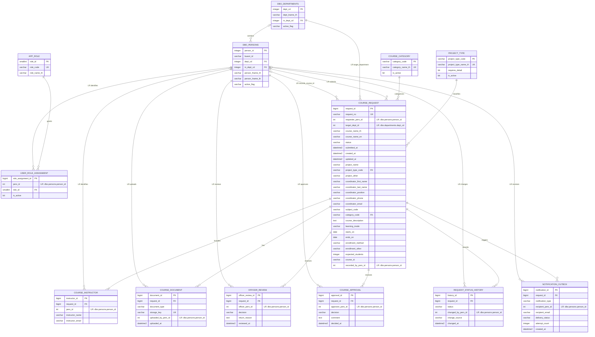

# ERD ระบบคำร้องขอสร้างรายวิชา

> สถานะการตรวจสอบ: ฝั่ง `saladb.dbo` ของ Server 199 ตรวจชื่อตารางและคอลัมน์กับ CSV snapshot แล้ว ส่วน `course133` รัน Laravel Migration ลง `academy_db1447` สำเร็จแล้วและเป็น As-built schema ของระบบปัจจุบัน

ระบบเป้าหมายแยกเป็น 2 SQL Server databases:

- Server 199 / `saladb.dbo`: บุคลากรและหน่วยงาน
- Server 133 / `academy_db1447.course133`: สิทธิ์ คำร้อง เอกสาร การตรวจ อนุมัติ และ Course ID

`LR` หมายถึง Logical Reference ไป Server 199 ช่วงแรกใช้ค่า `int` ที่กำหนดใน Laravel โดยยังไม่ตรวจข้าม Server

> ความสัมพันธ์หน่วยงานแม่–ลูกไม่แสดงเป็นเส้นในภาพใหญ่เพื่อป้องกันเส้นวนที่อ่านยาก โดย `dbo.departments.in_dept_cd` อ้าง `dbo.departments.dept_cd` ภายในตารางเดียวกัน

## สัญลักษณ์ของ Relation

| สัญลักษณ์ | Cardinality | ความหมาย |
|---|---|---|
| `||` | `1` | ต้องมีหนึ่งรายการเท่านั้น |
| `o|` | `0..1` | ไม่มีเลยหรือมีได้หนึ่งรายการ |
| `|{` | `1..N` | ต้องมีอย่างน้อยหนึ่งรายการและมีได้หลายรายการ |
| `o{` | `0..N` | ไม่มีเลยหรือมีได้หลายรายการ |
| `--` | — | เส้นเชื่อมความสัมพันธ์ระหว่างสองตาราง |

ให้อ่านเครื่องหมายที่อยู่ติดกับตารางแต่ละฝั่ง เช่น `PROJECT_TYPE ||--o{ COURSE_REQUEST` หมายถึงคำร้องแต่ละรายการต้องมีประเภทโครงการหนึ่งประเภท และประเภทหนึ่งถูกใช้กับคำร้องได้หลายรายการ

## คำอธิบายที่อยู่บนเส้น

คำบนเส้นให้อ่านจากชื่อตารางฝั่งซ้ายไปฝั่งขวา คำเหล่านี้ช่วยบอกหน้าที่ของความสัมพันธ์และไม่ใช่ชื่อคอลัมน์

| คำบนเส้น | อ่านว่า | ความหมายในระบบนี้ |
|---|---|---|
| `contains` | ประกอบด้วย/มี | หน่วยงานมีบุคลากรอยู่ภายใน |
| `grants` | มอบสิทธิ์ | Role ถูกนำไปกำหนดให้บุคลากรผ่าน `user_role_assignment` |
| `includes` | ประกอบด้วย | คำร้องมีรายชื่ออาจารย์ผู้สอนหนึ่งคนขึ้นไป |
| `has` | มี | คำร้องมีเอกสารที่เกี่ยวข้อง เช่น PDF ที่ระบบสร้างหรือ PDF ลงนามแล้ว |
| `receives` | ได้รับ | คำร้องได้รับผลตรวจหรือผลอนุมัติ; เมื่อใช้กับ notification หมายถึงบุคลากรเป็นผู้รับแจ้งเตือน |
| `classifies` | จัดประเภท | Master ประเภทโครงการถูกเลือกใช้ในคำร้อง |
| `categorizes` | จัดหมวดหมู่ | Master หมวดหมู่รายวิชาถูกเลือกใช้ในคำร้อง |
| `records` | บันทึก | คำร้องมีประวัติสถานะหลายเหตุการณ์ |
| `records_course_id` | บันทึก Course ID | บุคลากรเป็น Officer ผู้กรอก Course ID ลงในคำร้อง |
| `triggers` | กระตุ้นให้เกิด | เหตุการณ์ของคำร้องสร้างรายการแจ้งเตือนใน outbox |
| `identifies` | ระบุตัวบุคคล | รหัสบุคลากรจาก `dbo.persons` ใช้ระบุว่า role assignment หรือผู้สอนเป็นใคร |
| `submits` | ยื่นคำร้อง | บุคลากรเป็นผู้ยื่น `course_request` |
| `target_department` | หน่วยงานเป้าหมาย | ส่วนงาน/คณะ/สำนักที่ผู้ยื่นต้องการสร้างรายวิชาให้ โดยเจ้าหน้าที่สำนักคอมพิวเตอร์ยังเป็นผู้ตรวจคำร้อง |
| `uploads` | อัปโหลด | บุคลากรเป็นผู้สร้างหรืออัปโหลดเอกสาร |
| `reviews` | ตรวจสอบ | บุคลากรที่มีบทบาท Officer เป็นผู้ตรวจคำร้อง |
| `approves` | พิจารณาอนุมัติ | บุคลากรที่มีบทบาท Approver เป็นผู้อนุมัติ ปฏิเสธ หรือส่งกลับ |
| `changes` | เปลี่ยนสถานะ | บุคลากรเป็นผู้ทำให้สถานะคำร้องเปลี่ยน |
| `parent_of` | เป็นหน่วยงานแม่ของ | ใช้กับ `departments.in_dept_cd → departments.dept_cd`; คำนี้ถูกนำออกจากภาพใหญ่เพราะเส้นวนอ่านยาก |

คำที่ขึ้นต้นด้วย `LR` หมายถึงความสัมพันธ์นั้นเป็น Logical Reference ข้ามฐานข้อมูล เช่น `LR uploads` คือรหัสผู้อัปโหลดในฐาน 133 อ้างถึงบุคลากรในฐาน 199 โดยให้ Laravel ตรวจสอบ

## Cardinality หลัก

| Parent | Child | Cardinality | การบังคับ |
|---|---|---:|---|
| `dbo.departments` | `dbo.departments` | 1 : 0..N | FK `in_dept_cd` ภายในฐาน 199 |
| `dbo.departments` | `dbo.persons` | บุคคล 0..1 หน่วยงาน; หน่วยงาน 0..N บุคคล | FK `dept_cd` และ `in_dept_cd` เป็น nullable |
| `course133.app_role` | `course133.user_role_assignment` | 1 : 0..N | FK |
| `course133.course_request` | `course_instructor` | 1 : 1..N | FK; Laravel บังคับอย่างน้อย 1 คน |
| `course133.course_request` | `course_document` | 1 : 0..N | FK |
| `course133.course_request` | `officer_review` | 1 : 0..N | FK |
| `course133.course_request` | `course_approval` | 1 : 0..N | FK |
| `course133.project_type` | `course133.course_request` | 1 : 0..N | FK `project_type_code` |
| `course133.course_category` | `course133.course_request` | 1 : 0..N | FK `category_code` |
| `course133.course_request` | `request_status_history` | 1 : 0..N | FK |
| `course133.course_request` | `notification_outbox` | 1 : 0..N | FK |
| ฐาน 199 | คอลัมน์ที่ระบุ `LR` ในฐาน 133 | 1 : 0..N | Laravel ตรวจผ่าน 2 connections |

รายละเอียดคอลัมน์ทั้งหมดอยู่ใน [Data Dictionary](course-request-data-dictionary-th.md)

