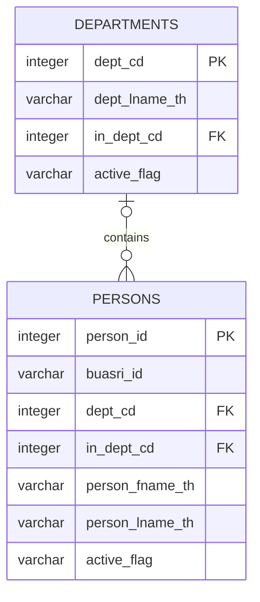

# Snapshot SQL Server 199 — Data Dictionary

แหล่งข้อมูลคือ `saladb.dbo.persons` และ `saladb.dbo.departments` ที่ export metadata และข้อมูล snapshot จาก SSMS เอกสารนี้ใช้อ้างอิงโครงสร้าง Server 199 ในช่วงที่ Laravel ยังใช้ค่าบุคลากรชั่วคราวจาก `.env`

- `persons.csv`: 1,000 แถว 52 คอลัมน์
- `departments.csv`: 578 แถว 18 คอลัมน์
- ไฟล์ CSV ไม่ถูกคัดลอกเข้า repository
- ชนิดข้อมูลด้านล่างเป็นชนิด PostgreSQL ที่ใช้รักษาค่าจาก snapshot

## Relation

`departments.in_dept_cd` ยังเป็น Foreign Key ที่อ้าง `departments.dept_cd` เพื่อแทนหน่วยงานแม่ แต่ไม่แสดงเป็นเส้นวนในภาพเพื่อให้อ่านง่าย

## `dbo.departments`

| Column | PostgreSQL Type | Key / Null | ความหมาย |
|---|---|---|---|
| `dept_cd` | integer | PK, NOT NULL | รหัสหน่วยงาน |
| `dept_lname_th` | varchar(255) | NOT NULL | ชื่อเต็มหน่วยงานภาษาไทย |
| `dept_sname_th` | varchar(255) | NULL | ชื่อสั้นภาษาไทย |
| `dept_abbv_th` | varchar(255) | NULL | อักษรย่อภาษาไทย |
| `dept_lname_eng` | varchar(255) | NULL | ชื่อเต็มหน่วยงานภาษาอังกฤษ |
| `dept_sname_eng` | varchar(255) | NULL | ชื่อสั้นภาษาอังกฤษ |
| `dept_abbv_eng` | varchar(255) | NULL | อักษรย่อภาษาอังกฤษ |
| `in_dept_cd` | integer | FK, NULL | รหัสหน่วยงานแม่ |
| `active_flag` | varchar(1) | NULL | สถานะจากระบบต้นทาง |
| `creation_dtm` | timestamp(3) | NULL | เวลาสร้างในระบบต้นทาง |
| `creation_by` | varchar(255) | NULL | ผู้สร้างในระบบต้นทาง |
| `last_update_dtm` | timestamp(3) | NULL | เวลาแก้ไขล่าสุดในระบบต้นทาง |
| `last_update_by` | varchar(255) | NULL | ผู้แก้ไขล่าสุดในระบบต้นทาง |
| `register_flag` | varchar(1) | NULL | สถานะด้านทะเบียน |
| `gov_dept_flag` | varchar(10) | NULL | ประเภทรหัสหน่วยงานภาครัฐ |
| `fin_in_dept_cd` | integer | NULL | รหัสหน่วยงานด้านการเงิน |
| `created_at` | timestamp(3) | NULL | เวลาสร้างข้อมูล snapshot |
| `updated_at` | timestamp(3) | NULL | เวลาแก้ไขข้อมูล snapshot |

## `dbo.persons`

ตารางนี้ไม่เก็บ password และ `buasri_id` ไม่เป็น Unique Key เพราะ snapshot ที่ได้รับมีค่าซ้ำและค่าว่าง

| Column | PostgreSQL Type | Key / Null | ความหมาย |
|---|---|---|---|
| `person_id` | integer | PK, NOT NULL | รหัสบุคลากรและคีย์หลัก |
| `buasri_id` | varchar(50) | NULL | บัญชี Buasri ID; อาจว่างและไม่เก็บรหัสผ่าน |
| `gafe_account` | varchar(100) | NULL | บัญชี Google Workspace เดิม |
| `prename_sname_th` | varchar(255) | NULL | คำนำหน้าชื่อแบบสั้นภาษาไทย |
| `prename_lname_th` | varchar(255) | NULL | คำนำหน้าชื่อแบบเต็มภาษาไทย |
| `prename_sname_eng` | varchar(255) | NULL | คำนำหน้าชื่อแบบสั้นภาษาอังกฤษ |
| `prename_lname_eng` | varchar(255) | NULL | คำนำหน้าชื่อแบบเต็มภาษาอังกฤษ |
| `person_fname_th` | varchar(255) | NULL | ชื่อภาษาไทย |
| `person_lname_th` | varchar(255) | NULL | นามสกุลภาษาไทย |
| `person_fname_eng` | varchar(255) | NULL | ชื่อภาษาอังกฤษ |
| `person_lname_eng` | varchar(255) | NULL | นามสกุลภาษาอังกฤษ |
| `dept_cd` | integer | FK, NULL | รหัสหน่วยงาน |
| `division` | varchar(500) | NULL | ชื่อส่วนงาน |
| `in_dept_cd` | integer | FK, NULL | รหัสหน่วยงานแม่ |
| `faculty` | varchar(500) | NULL | ชื่อคณะหรือหน่วยงาน |
| `sex_type` | smallint | NULL | รหัสเพศ |
| `marry_status_cd` | smallint | NULL | รหัสสถานภาพสมรส |
| `person_type_cd` | smallint | NULL | รหัสประเภทบุคลากร |
| `remark` | text | NULL | หมายเหตุ |
| `start_date` | timestamp(3) | NULL | วันที่เริ่มต้น |
| `end_date` | timestamp(3) | NULL | วันที่สิ้นสุด |
| `active_flag` | varchar(1) | NULL | สถานะจากระบบต้นทาง |
| `creation_dtm` | timestamp(3) | NULL | เวลาสร้างในระบบต้นทาง |
| `creation_by` | varchar(255) | NULL | ผู้สร้างในระบบต้นทาง |
| `last_update_dtm` | timestamp(3) | NULL | เวลาแก้ไขล่าสุดในระบบต้นทาง |
| `last_update_by` | varchar(255) | NULL | ผู้แก้ไขล่าสุดในระบบต้นทาง |
| `in_telephone_no` | varchar(100) | NULL | หมายเลขโทรศัพท์ภายใน |
| `id_card_no` | varchar(50) | NULL | เลขประจำตัวประชาชน |
| `person_mname_th` | varchar(255) | NULL | ชื่อกลางภาษาไทย |
| `person_mname_eng` | varchar(255) | NULL | ชื่อกลางภาษาอังกฤษ |
| `passport_no` | varchar(100) | NULL | เลขหนังสือเดินทาง |
| `did_phone_no` | varchar(100) | NULL | หมายเลขโทรศัพท์ DID |
| `start_date_at_swu` | timestamp(3) | NULL | วันที่เริ่มงานที่มหาวิทยาลัย |
| `retire_date` | timestamp(3) | NULL | วันที่เกษียณหรือสิ้นสุดงาน |
| `retire_reason_cd` | integer | NULL | รหัสเหตุผลสิ้นสุดงาน |
| `retire_desc` | varchar(500) | NULL | รายละเอียดการสิ้นสุดงาน |
| `mobile_phone` | varchar(255) | NULL | หมายเลขโทรศัพท์มือถือ |
| `birth_date` | timestamp(3) | NULL | วันเกิด |
| `blood_group` | varchar(10) | NULL | กรุ๊ปเลือด |
| `race_cd` | integer | NULL | รหัสเชื้อชาติ |
| `nation_cd` | integer | NULL | รหัสสัญชาติ |
| `religion_cd` | integer | NULL | รหัสศาสนา |
| `disease` | text | NULL | ข้อมูลโรค |
| `military_status` | integer | NULL | สถานะทางทหาร |
| `total_cousin` | integer | NULL | จำนวนพี่น้องรวม |
| `seq_cousin` | integer | NULL | ลำดับพี่น้อง |
| `created_at` | timestamp(3) | NULL | เวลาสร้างข้อมูล snapshot |
| `updated_at` | timestamp(3) | NULL | เวลาแก้ไขข้อมูล snapshot |
| `office_account` | varchar(100) | NULL | บัญชี Microsoft Office |
| `office_account_at` | timestamp(3) | NULL | เวลาสร้างบัญชี Microsoft Office |
| `position` | varchar(500) | NULL | ตำแหน่ง |
| `is_teacher` | smallint | NULL | สถานะอาจารย์ |

## การเชื่อมกับฐาน 133

- ใช้ `dbo.persons.person_id` เป็นรหัสบุคลากรหลัก
- ใช้ `dbo.persons.buasri_id` เพื่อค้นหาบุคคลหลัง SSO/LDAP ยืนยันตัวตน
- ใช้ `dbo.departments.dept_cd` เป็นรหัสหน่วยงาน
- PostgreSQL ไม่สร้าง Foreign Key ข้าม database; Laravel ต้องตรวจรหัสผ่าน connection ของฐาน 199
